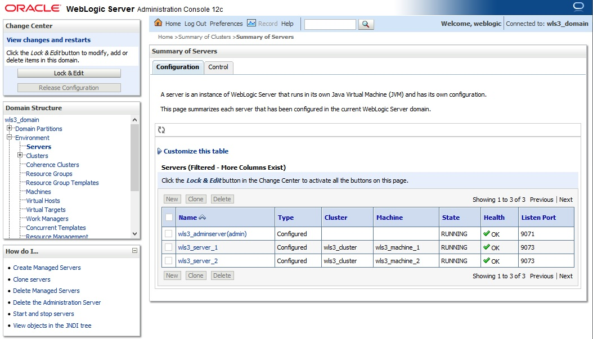

# How to Configure WebLogic-Coherence Cluster for Replicated/Distributed Cache

## Pre-requisite

This guide assumes you have already have installed clustered WebLogic domain 12.2.1.4. Also .gar and .ear file that will be deployed.

## Hands on Lab

If we create using WebLogic marketplace then there will be 2 clustered managed server that we can use directly, this cluster will be deployed with .ear file as our WebApplication-Coherence demo.

So we need to create another set of two managed server and put it into 1 cluster, where this cluster will be installed with .gar that make this cluster as data cache storage.

Now we need to create 1 Coherence cluster, under domain tree -> Environment -> Coherence Clusters, and create new, input the name as demoCohCluster like below.

After click next we choose **Unicast** as clustering mode and leave the port as it is:

After click next we choose the member of the Coherence cluster, in this case it will be both application (wls_cluster) and data cache (wls_cluster_data) cluster:

Do not forget to activate the changes.

Now we need to configure cache storage capability only for wls_cluster_data:

By disabling it in wls_cluster, it should be like below:

Now we need to do deployment for the .gar files in the wls_cluster_data, go to Deployments, and click install

Now locate the .gar file in this case myCache.gar like below

Choose Install this deployment as an application, like below

Then pick the target which is for wls_cluster_data

After that click next

Then click Finish

Now click Save and Activate Changes

Then click tab Control to make the deployment starting the service

Then click yes to start Application

We can check if the deployment success or not by looking through the logs, saying the member already 2.

Now we need to do deployments for the .ear file in this case myApp.ear, do the same thing like previously with exception in the target it will pointed to wls_cluster

If the deployment success we can see from the logs saying that member 3 and 4 is joining the coherence cluster, like below:

Then now we can test if the demo apps is working or not, by accessing the demo WebApp by go to http://ip:port/demo/cohwlsdemo

The above example will input into cache with key DateRandom, where the content is in hashtable format containing key=random-number and value=current-time and everytime the page get refreshed it will insert new value and show the final value.
