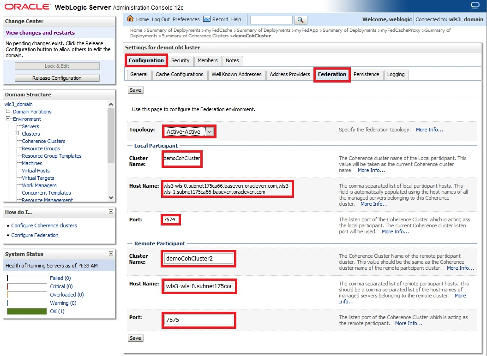
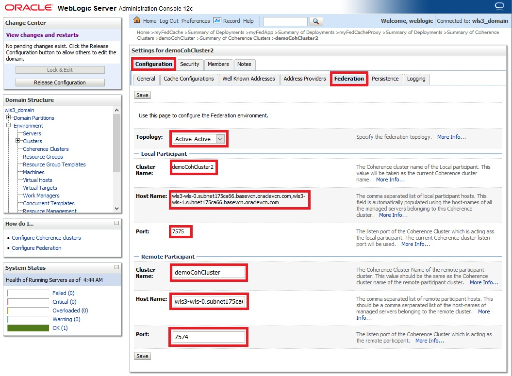
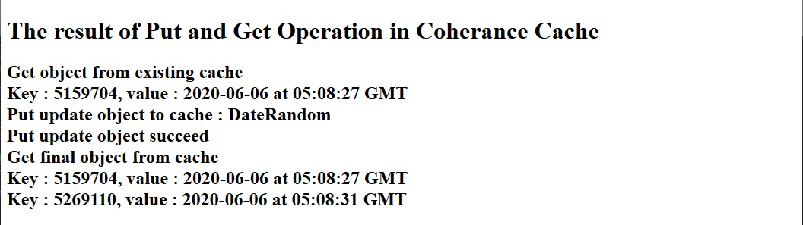

# How to Configure WebLogic-Coherence Cluster for Federated Cache

## Pre-requisite

This guide assumes you have already have installed clustered WebLogic domain 12.2.1.4. Also .gar and .ear file that will be deployed.

## Hands on Lab

We will continue the lab using previous setup for deployment and cluster setup for WebLogic and Coherence. We need to delete the existing deployment first, but make sure all managed server are shutdown first


After delteing the deployment files we need to re-create the .ear and .gar files, this is because the cache configuration must be changed from distributed/replicated to federated cache. If you clone the gir repo from this Hands on Lab then go to directory artifacts.
```
drwxrwxr-x. 9 opc opc     4096 Jun  3 07:45 .
drwxrwxr-x. 6 opc opc     4096 Jun  3 07:45 ..
-rw-rw-r--. 1 opc opc 13505055 Jun  3 07:45 coherence.jar
drwxrwxr-x. 2 opc opc       69 Jun  3 07:45 cohOverride
drwxrwxr-x. 3 opc opc       40 Jun  3 07:45 javaCode
drwxrwxr-x. 3 opc opc       22 Jun  3 07:45 myApp.ear
drwxrwxr-x. 3 opc opc       22 Jun  3 07:45 myCache.gar
drwxrwxr-x. 3 opc opc       22 Jun  3 07:45 myFedApp.ear
drwxrwxr-x. 3 opc opc       22 Jun  3 07:45 myFedCache.gar
drwxrwxr-x. 3 opc opc       22 Jun  3 07:45 myFedCacheProxy.gar
```
### Create .gar file for Data Cache

Go to directory myFedCache.gar and do the same steps like in the [Step 1](create.data.gar.md) use the configuration for the [federated cache](https://github.com/tazlambert/coherence-weblogic/blob/master/tutorial/create.data.gar.md#federated-cache). A little different part is to create **different .gar filename** for the .gar files, when we package into .gar we type this command inside myFedCache.gar directory:
```
jar cvf myFedCache.gar *
```
### Create .ear file for Web Application

Go to directory myFedApp.ear and do the same steps like in the [Step 3](create.ear.md) and pay attention on **different .gar filename** but **same .war filename** and when we want to create .ear file we use different filename in the directory myFedApp.ear:
```
jar cvf myFedApp.ear *
```
### Create .gar file for Proxy Cache

Go to directory myFedCacheProxy.gar and do the same steps like in the [Step 2](create.proxy.gar.md) use the configuration for the [federated cache](https://github.com/tazlambert/coherence-weblogic/blob/master/tutorial/create.proxy.gar.md#federated-cache).A little different part is to create **different .gar filename** for the .gar files, when we package into .gar we type this command inside myFedCacheProxy.gar directory:
```
jar cvf myFedCacheProxy.gar *
```

### Setting Up the WebLogic

For the federated cache labs we need to create another Coherence cluster, WebLogic cluster, as if these cluster are hosted in the different environment, since the purpose of federated the Coherence is to create setup for DC-DRC or separated geographically cluster. In this case the new created cluster will be deployed with [.gar for Proxy cache](https://github.com/tazlambert/coherence-weblogic/blob/master/tutorial/create.wls.fed.cache.md#create-gar-file-for-proxy-cache) so that we can do federated testing by accessing data cache from original Coherence cluster (demoCohCluster) using java code. So now we need to create 2 new managed server first that are member of cluster2.


Next we need to create new Coherence cluster named demoCohCluster2, we need to use different port for Unicast;


Make sure the member of the Coherence cluster are correct:


So now we have to different Coherence cluster and if we use cache scheme Replicated or Distributed it is not possible to share the data between those two Coherence cluster:


After that we need to deploy all three file that created before: myFedCache.gar, myFedApp.ear, myFedCacheProxy.gar into the respective cluster and after finish installing them do not forget to activate them in the tonrol tab.


### Setting Up the Coherence federated cluster

After the Coherence cluster already setup then we need to configure the federation part, now go to the demoCohCluster and choose tab Federation and do the configuration like below:



Then next is to go to the demoCohCluster2 and choose tab Federation and do the configuration like below:



Then we can test the Coherence cluster from the web application like below:



Now we need to test the data that already inside demoCohCluster from demoCohCluster2, and demoCohCLuster2 is configured with extendedProxy that makes the data in the cache can be accessed with the client that is not a member of the Federated Cache Cluster. So we will simple java code to access it, the java code is availbe inside artifacts directory of this git repo.
```
cd
cd coherence-weblogic/artifacts
mkdir -p classes/com/demo/coherence/
javac -Xlint:unchecked -cp coherence.jar javaCode/com/demo/coherence/FinalTest.java
mv javaCode/com/demo/coherence/FinalTest.class classes/com/demo/coherence/
```
Now we need to configure Coherence config file for the java code that located in the cohOverride directory, make sure that tangosol-coherence-override.xml file are like below, make sure the **Coherence cluster-name, coherence.wka, coherence.wka2 and coherence.cacheconfig is correct**:
```
<?xml version='1.0'?>

<coherence xmlns:xsi="http://www.w3.org/2001/XMLSchema-instance"
   xmlns="http://xmlns.oracle.com/coherence/coherence-operational-config"
   xsi:schemaLocation="http://xmlns.oracle.com/coherence/coherence-operational-config
   coherence-operational-config.xsd">
   <cluster-config>
      <member-identity>
         <cluster-name>demoCohCluster2</cluster-name>
      </member-identity>
      <unicast-listener>
         <socket-provider system-property="coherence.socketprovider">tcp</socket-provider>
         <well-known-addresses>
            <address system-property="coherence.wka">10.0.3.15</address>
            <address system-property="coherence.wka1">10.0.3.16</address>
         </well-known-addresses>
      </unicast-listener>
      <services>
         <service id="3">
            <init-params>
               <init-param id="4">
                  <param-name>local-storage</param-name>
                  <param-value system-property="tangosol.coherence.distributed.
                     localstorage">false</param-value>
               </init-param>
            </init-params>
         </service>
      </services>
   </cluster-config>

   <configurable-cache-factory-config>
      <init-params>
         <init-param>
            <param-type>java.lang.String</param-type>
            <param-value system-property="coherence.cacheconfig">/home/opc/coherence-weblogic/artifacts/cohOverride/cache-config.xml</param-value>
         </init-param>
      </init-params>
   </configurable-cache-factory-config>
   <license-config>
      <license-mode system-property="tangosol.coherence.mode">prod</license-mode>
   </license-config>
</coherence>
```
While for the cacheconfig file it must be like below and pay attention to **cache-name that want to be accessed and the port of extended proxy that installed in demoCohCluster2**:
```
<?xml version="1.0"?>

<cache-config xmlns:xsi="http://www.w3.org/2001/XMLSchema-instance"
   xmlns="http://xmlns.oracle.com/coherence/coherence-cache-config"
   xsi:schemaLocation="http://xmlns.oracle.com/coherence/coherence-cache-config
   coherence-cache-config.xsd">

   <caching-scheme-mapping>
      <cache-mapping>
         <cache-name>datacache</cache-name>
         <scheme-name>remote1</scheme-name>
      </cache-mapping>
   </caching-scheme-mapping>
  <caching-schemes>
    <remote-cache-scheme>
      <scheme-name>remote1</scheme-name>
      <service-name>ExtendTcpCacheService</service-name>
      <initiator-config>
        <tcp-initiator>
          <remote-addresses>
            <socket-address>
              <address>localhost</address>
              <port>1111</port>
            </socket-address>
          </remote-addresses>
        </tcp-initiator>
      </initiator-config>
    </remote-cache-scheme>
  </caching-schemes>
</cache-config>
```
Then we can start the java code to run by executing below commands:
```
cd
cd coherence-weblogic/artifacts
java -server -classpath classes:coherence.jar -Dtangosol.coherence.override=cohOverride/tangosol-coherence-override.xml  com.demo.coherence.
```
The expected result will be like:
```
2020-06-06 05:41:44.998/0.691 Oracle Coherence 12.2.1.4.4 <Info> (thread=main, member=n/a): Loaded operational configuration from "jar:file:/home/opc/coherence-weblogic/artifacts/coherence.jar!/tangosol-coherence.xml"
2020-06-06 05:41:45.072/0.765 Oracle Coherence 12.2.1.4.4 <Info> (thread=main, member=n/a): Loaded operational overrides from "jar:file:/home/opc/coherence-weblogic/artifacts/coherence.jar!/tangosol-coherence-override-dev.xml"
2020-06-06 05:41:45.126/0.820 Oracle Coherence 12.2.1.4.4 <Info> (thread=main, member=n/a): Loaded operational overrides from "file:/home/opc/coherence-weblogic/artifacts/cohOverride/tangosol-coherence-override.xml"
2020-06-06 05:41:45.133/0.827 Oracle Coherence 12.2.1.4.4 <Info> (thread=main, member=n/a): Optional configuration override "cache-factory-config.xml" is not specified
2020-06-06 05:41:45.134/0.827 Oracle Coherence 12.2.1.4.4 <Info> (thread=main, member=n/a): Optional configuration override "cache-factory-builder-config.xml" is not specified
2020-06-06 05:41:45.134/0.827 Oracle Coherence 12.2.1.4.4 <Info> (thread=main, member=n/a): Optional configuration override "/custom-mbeans.xml" is not specified

Oracle Coherence Version 12.2.1.4.4 Build 77350
 Grid Edition: Development mode
Copyright (c) 2000, 2020, Oracle and/or its affiliates. All rights reserved.

2020-06-06 05:41:45.361/1.055 Oracle Coherence GE 12.2.1.4.4 <Info> (thread=main, member=n/a): Loaded cache configuration from "file:/home/opc/coherence-weblogic/artifacts/cohOverride/cache-config.xml"
2020-06-06 05:41:45.806/1.500 Oracle Coherence GE 12.2.1.4.4 <Info> (thread=main, member=n/a): Created cache factory com.tangosol.net.ExtensibleConfigurableCacheFactory
Get object from existing cache
        Key : 5159704, value : 2020-06-06 at 05:08:27 GMT
        Key : 5269110, value : 2020-06-06 at 05:08:31 GMT
```
The result will be the same like from the web application.
