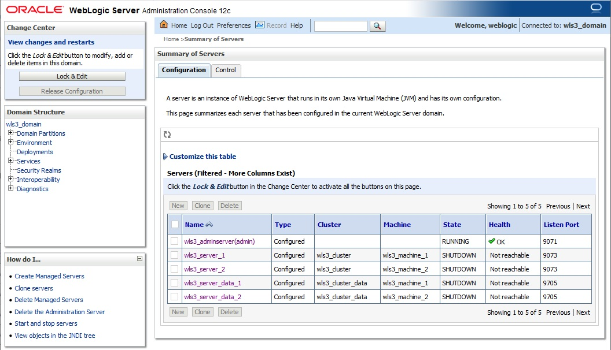
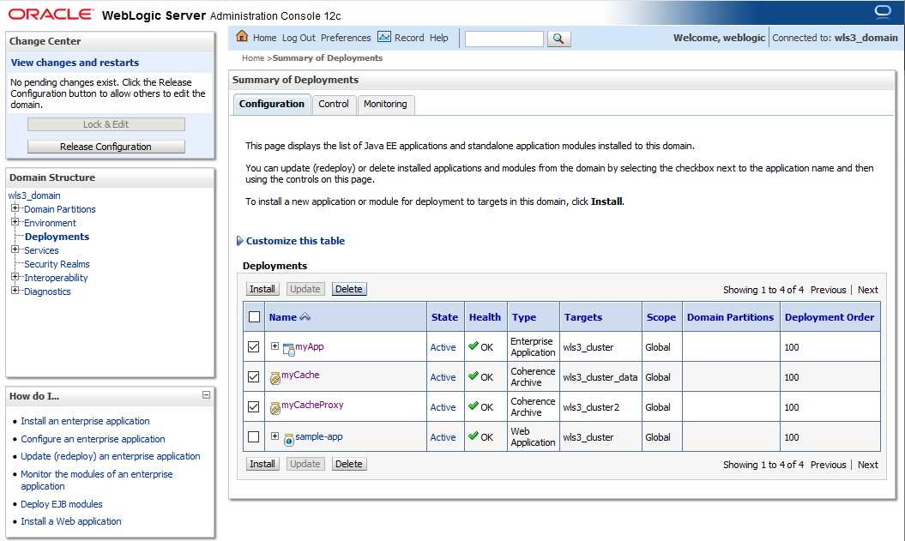
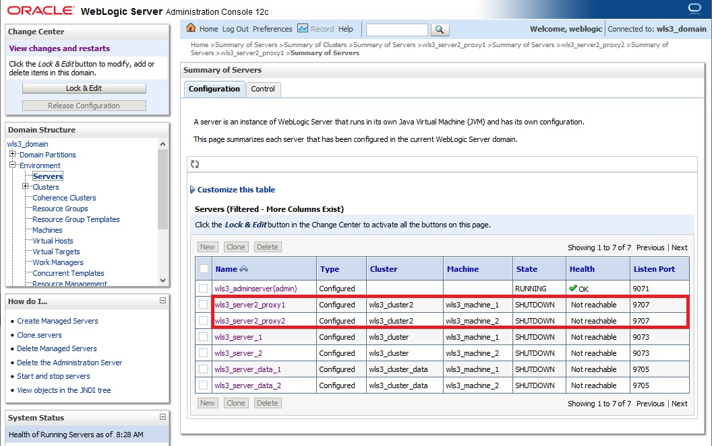
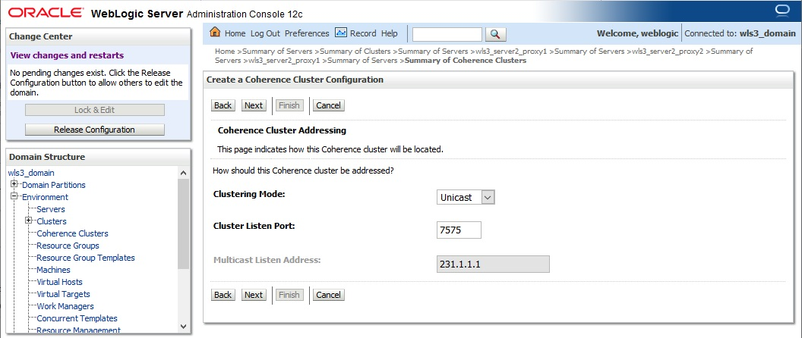
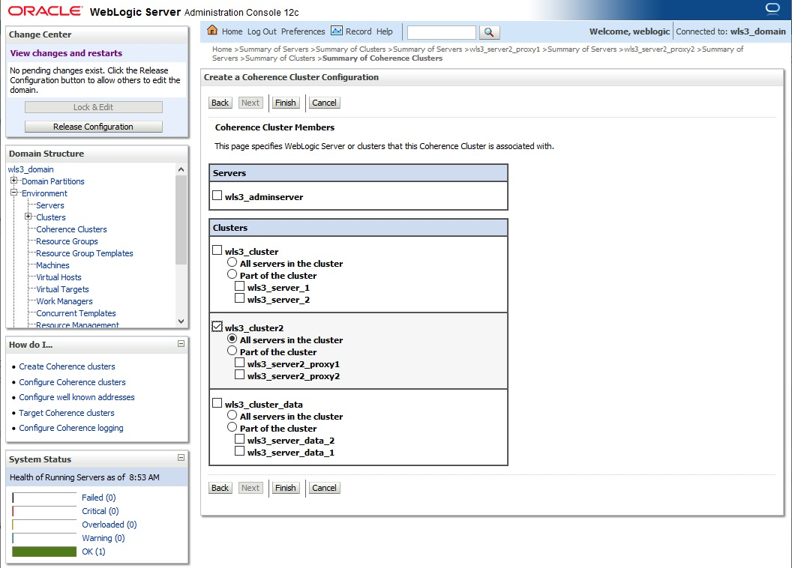
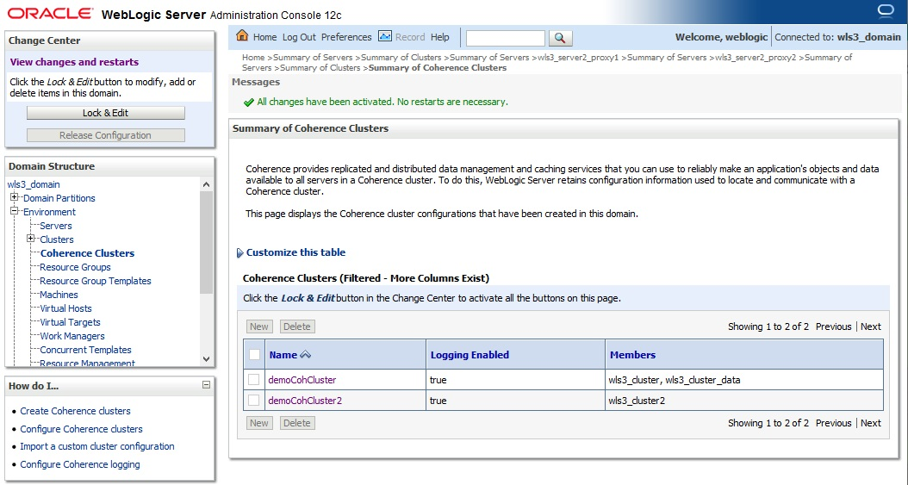
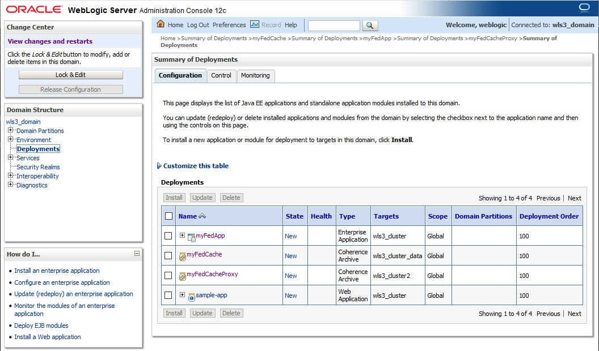

# How to Configure WebLogic-Coherence Cluster for Federated Cache

## Pre-requisite

This guide assumes you have already have installed clustered WebLogic domain 12.2.1.4. Also .gar and .ear file that will be deployed.

## Hands on Lab

We will continue the lab using previous setup for deployment and cluster setup for WebLogic and Coherence. We need to delete the existing deployment first, but make sure all managed server are shutdown first




After delteing the deployment files we need to re-create the .ear and .gar files, this is because the cache configuration must be changed from distributed/replicated to federated cache. If you clone the gir repo from this Hands on Lab then go to directory artifacts.
```
drwxrwxr-x. 9 opc opc     4096 Jun  3 07:45 .
drwxrwxr-x. 6 opc opc     4096 Jun  3 07:45 ..
-rw-rw-r--. 1 opc opc 13505055 Jun  3 07:45 coherence.jar
drwxrwxr-x. 2 opc opc       69 Jun  3 07:45 cohOverride
drwxrwxr-x. 3 opc opc       40 Jun  3 07:45 javaCode
drwxrwxr-x. 3 opc opc       22 Jun  3 07:45 myApp.ear
drwxrwxr-x. 3 opc opc       22 Jun  3 07:45 myCache.gar
drwxrwxr-x. 3 opc opc       22 Jun  3 07:45 myFedApp.ear
drwxrwxr-x. 3 opc opc       22 Jun  3 07:45 myFedCache.gar
drwxrwxr-x. 3 opc opc       22 Jun  3 07:45 myFedCacheProxy.gar
```
### Create .gar file for Data Cache

Go to directory myFedCache.gar and do the same steps like in the [Step 1](create.data.gar.md) use the configuration for the [federated cache](https://github.com/tazlambert/coherence-weblogic/blob/master/tutorial/create.data.gar.md#federated-cache). A little different part is to create **different .gar filename** for the .gar files, when we package into .gar we type this command inside myFedCache.gar directory:
```
jar cvf myFedCache.gar *
```
### Create .ear file for Web Application

Go to directory myFedApp.ear and do the same steps like in the [Step 3](create.ear.md) and pay attention on **different .gar filename** but **same .war filename** and when we want to create .ear file we use different filename in the directory myFedApp.ear:
```
jar cvf myFedApp.ear *
```
### Create .gar file for Proxy Cache

Go to directory myFedCacheProxy.gar and do the same steps like in the [Step 2](create.proxy.gar.md) use the configuration for the [federated cache](https://github.com/tazlambert/coherence-weblogic/blob/master/tutorial/create.proxy.gar.md#federated-cache).A little different part is to create **different .gar filename** for the .gar files, when we package into .gar we type this command inside myFedCacheProxy.gar directory:
```
jar cvf myFedCacheProxy.gar *
```

### Setting Up the WebLogic

For the federated cache labs we need to create another Coherence cluster, WebLogic cluster, as if these cluster are hosted in the different environment, since the purpose of federated the Coherence is to create setup for DC-DRC or separated geographically cluster. In this case the new created cluster will be deployed with [.gar for Proxy cache](https://github.com/tazlambert/coherence-weblogic/blob/master/tutorial/create.wls.fed.cache.md#create-gar-file-for-proxy-cache) so that we can do federated testing by accessing data cache from original Coherence cluster (demoCohCluster) using java code. So now we need to create 2 new managed server first that are member of cluster2.



Next we need to create new Coherence cluster named demoCohCluster2, we need to use different port for Unicast;



Make sure the member of the Coherence cluster are correct:



So now we have to different Coherence cluster and if we use cache scheme Replicated or Distributed it is not possible to share the data between those two Coherence cluster:



After that we need to deploy all three file that created before: myFedCache.gar, myFedApp.ear, myFedCacheProxy.gar into the respective cluster and after finish installing them do not forget to activate them in the tonrol tab.



### Setting Up the Coherence federated cluster

After the Coherence cluster already setup then we need to configure the federation part, now go the demoCohCluster
